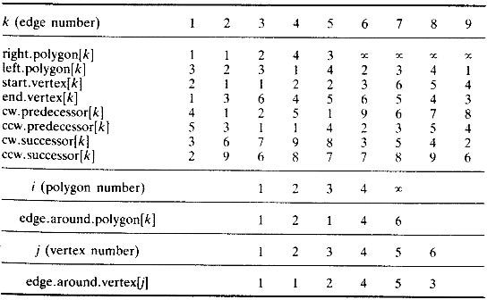
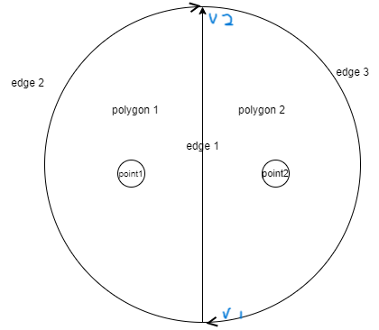
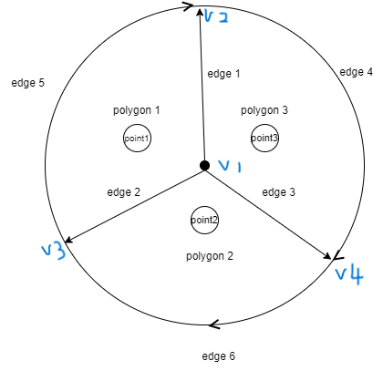
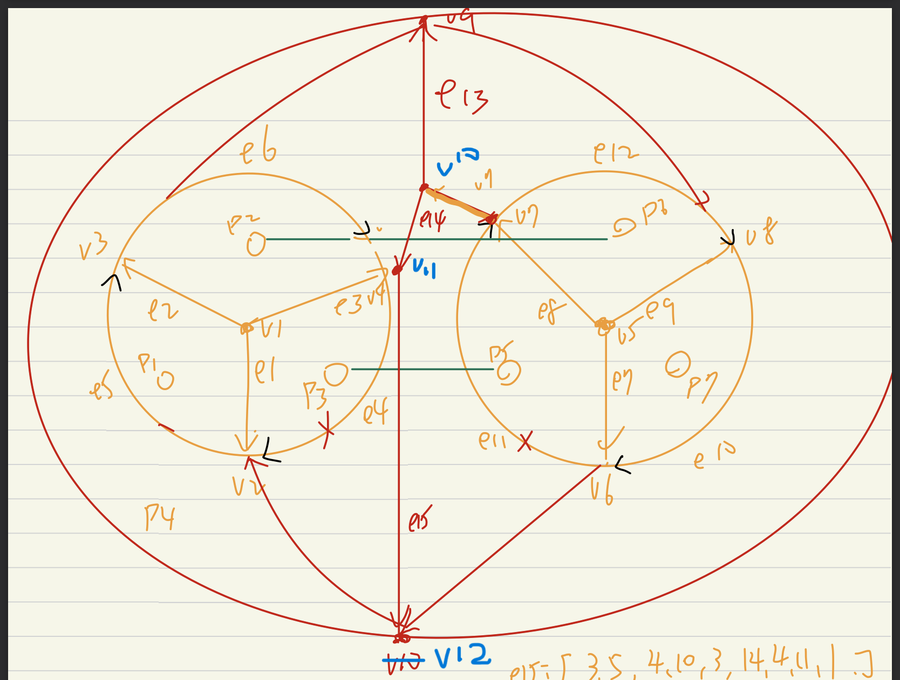

# VoronoiDiagram

***

####voronoi diagram with Python

M123040052 資訊系碩一 李適宏
***
## Execution Guide

1. Download [Latest Release](https://github.com/KGODPHBKO/voronoi/releases/v3.0)
2. Extract the zip
3. Execute `voronoi.exe`
***
### Software Specification Document
##### Input and Output (Data) Specifications
#####Input
1.Mouse clicks at any point on the canvas, with a canvas size of 600*600.
2.Read in the "input text file." [dataform](https://par.cse.nsysu.edu.tw/~cbyang/course/algo/vd_testdata.in)
3.
Read in the "output text file" and directly draw the graphics on the canvas.

#####Output
1.After run will have an output
2.
Output Text File Example
+ P 100 100
+ P 100 200
+ P 200 100
+ P200 200
+ E 0 150 150 150
+ E 150 0 150 150
+ E 105 150 150 600
+ E 150 150 600 150
 
***
## Algorithm
use divide and Conquer

###Codes with python and the Interface use Tkinter
###Data structure

|Data structure for Voronoi diagram|Data structure for Voronoi diagram|
|----|----|
|Edge (the edge in the diagram)|Convex Hull|
||concexHull = [a,b] //a,b means the left and right point|
|Vertex (the vertex in the diagram)||
|vertex =[x,y,0 if vertex exit else 1]|
|Point (the point you click)||
|point = [x,y]|

###If less than three points
|two point|three point|
|---|--|
|||

###point more than three
#### Divide
divide all generator points to a complete tree

#### Convex Hull
+ record the rightmost and leftmost point in a convex hull
    1. Find the centroid of points within the convex hull, and represent each point in polar coordinates with the centroid as the origin.
    2. Create a stack and initially add the first and second points to the stack.
    3. 1point  = popstack 2point = popstack
    4. Sequentially process each point with the following logic: If the turn from point 1 -> point 2 -> point 3 is left, push point 3 into the stack. If it is a right turn, pop point 2, then push point 3. Repeat this process until the last point is reached.

#### Merge

1. find upper tangent and lower tangent with Convex Hull algorithm
2. Iteratively find the mid-perpendicular line from upper tangent to lower tangent
    + delete vertex and edge right from intersection in left voronoi diagram
    + delete vertex and edge left from intersection in right voronoi diagram

    

## Time Complexity
time complexity is **`O(log(n))`**

***

## Demo
####Execution Environment
+ 程式語言: python 3.11.5
+ 作業系統：Windows 10
+ 編輯器：Visual Studio Code
***
####Windows Version

***
####System

***
## Experience result
|[3 points]|[4 points]|
|-|-|
|||

|[5 points]|[6 points]|
|-|-|
|||

|[7 points]|[8 points]|
|-|-|
|||
***

## Conclusion and Reflections
一開始我是按照自己的想法下去做，但我做到超過四點的時候發現做不下去，
所以我去翻閱了老師給的四頁論文，發現他的設計非常厲害，如果不是有看過這篇我覺得應該做不到10點以上，所以我就按照論文的設計方法下去實做，之後遇到了削線的問題在依些case內需要把start點削掉但有些要把end削掉，在畫了無數次的圖模擬演練後終於得出答案，
在中垂線撞到點的時候一開始想說只會撞到無限延伸的邊但是在到點多的時候是會撞到兩端都是封閉的邊，這邊也卡了很久，再中垂線上撞到的邊有許多種情況在一開始沒有都想到所以在debug的時候是非常辛苦的，常常要看很久才知道是哪一部份邏輯並沒有補上。

我覺得這個term project 考驗的不是學生coding能力，而是在設計演算法的能力，演算法設計得夠好，想到越多種case並加以處理，這個project其實不難。我自己只有做到6.以下完美，以上都要靠運氣，但由於線真的太多了，case也有一些想不到，經過這次的term project我的心得是，演算法的設計真的是一門大學問，受益良多。
